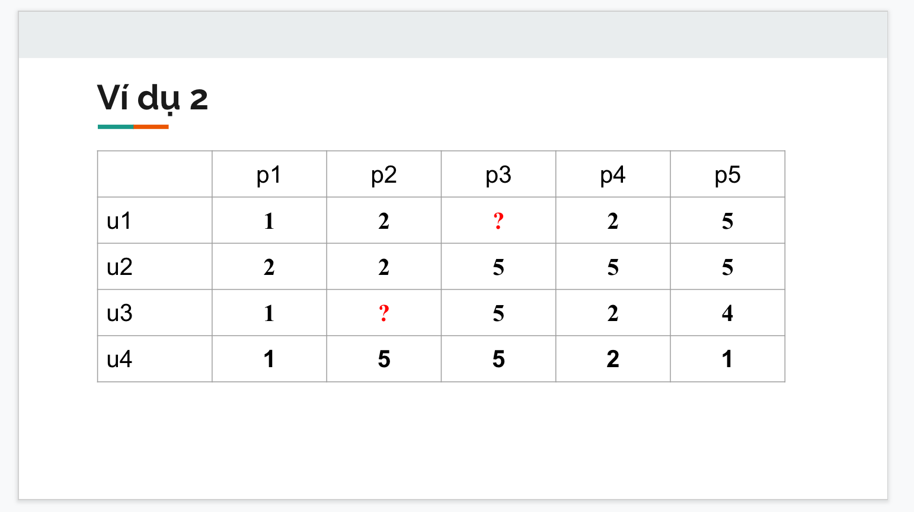
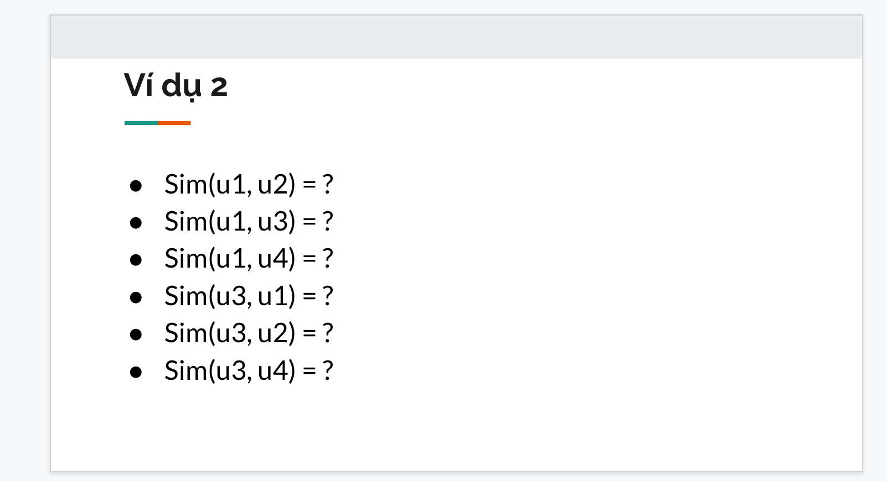

Cho ma trận đánh giá mức độ quan tâm của user u[i] lên sản phẩm product p[i] như hình:

Tính độ tương quan sau:

Input: Ma trận đánh giá (Rating matrix) mức độ quan tâm của user ui lên sản phẩm pi
Output: Độ tương quan của User i với User j (i != j)
Kết quả trong file [BTQT_2.ipynb](BTQT_2.ipynb)